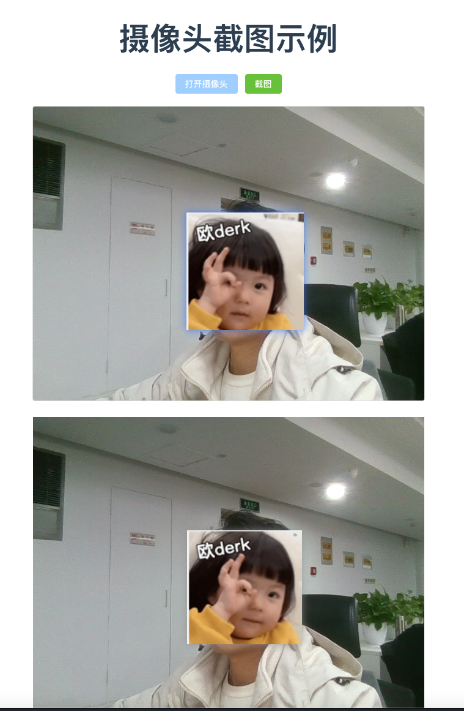

# Vue3 ElementPlus 摄像头截图项目

## 项目概述
这是一个基于 Vue3 和 ElementPlus 的摄像头截图工具，可以实现：
1. 打开电脑摄像头
2. 实时预览摄像头画面
3. 截图并转换为 Blob 或 Base64 格式

## 功能特性
- 使用 `navigator.mediaDevices.getUserMedia` 调用摄像头
- 使用 Canvas 实现截图功能
- 支持将截图转换为 Blob 或 Base64 格式
- 基于 ElementPlus 的 UI 组件

## 预览



## 快速开始

### 安装依赖

```sh
npm install
```

### 运行项目

```sh
npm run dev
```

### 构建项目

```sh
npm run build
```

## 使用说明
1. 点击 "打开摄像头" 按钮，授权使用摄像头
2. 摄像头画面会显示在页面中
3. 点击 "截图" 按钮，截取当前画面
4. 截图结果会自动转换为 Blob 和 Base64 格式
5. 可以在控制台查看转换后的数据


## 技术栈
- Vue3
- ElementPlus
- HTML5 MediaDevices API
- Canvas API

## 注意事项
1. 需要在 HTTPS 或 localhost 环境下运行
2. 首次使用需要授权摄像头权限
3. 截图质量可以通过调整 Canvas 参数进行优化

## 许可证
MIT License